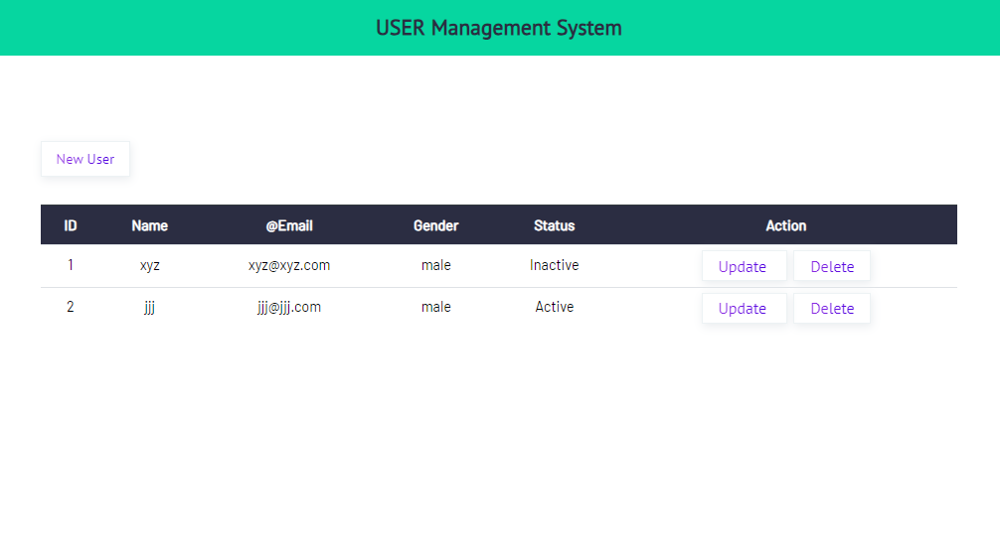

User Management System
======================

This project is a simple User Management System built with Node.js, Express, MongoDB, and client-side JavaScript (jQuery). It allows users to perform CRUD operations (Create, Read, Update, Delete) on user records.


Screenshots
------------------

### Home Page


### Add User Page


### User Added


### Update User Page


### Delete user


Functionalities
---------------

-   **Create User:** Add a new user with details like name, email, and role.
-   **Read Users:** View a list of all users.
-   **Update User:** Edit user details.
-   **Delete User:** Remove a user from the system.

Prerequisites
-------------

Before you begin, ensure you have the following installed:

-   Node.js and npm (Node Package Manager)
-   MongoDB (Community Edition or Atlas cloud service)

Getting Started
---------------

To get a local copy up and running follow these simple steps:

### Installation

1.  Clone the repo:

    bash

    Copy code

    ```git clone https://github.com/nirravv/User-management-system.git```

2.  Install NPM packages:

    ```cd user-management-system```
    ```npm install```

### Configuration

1.  modify a `config.env` file in the root directory of the project according to your needs.

### Running the Server

1.  Start MongoDB service.
2.  Run the Node.js server:

    ```npm run start```

Usage
-----

Open your web browser and navigate to `http://localhost:8080` to access the User Management System.

API Endpoints
-------------

-   **POST `/api/users`**: Create a new user.
-   **GET `/api/users`**: Fetch all users.
-   **PUT `/api/users/:id`**: Update a user by ID.
-   **DELETE `/api/users/:id`**: Delete a user by ID.

Contributing
------------

Contributions are what make the open-source community such an amazing place to learn, inspire, and create. Any contributions you make are **greatly appreciated**.

1.  Fork the Project
2.  Create your Feature Branch (`git checkout -b feature/AmazingFeature`)
3.  Commit your Changes (`git commit -m 'Add some AmazingFeature'`)
4.  Push to the Branch (`git push origin feature/AmazingFeature`)
5.  Open a Pull Request

License
-------

Distributed under the MIT License. See `LICENSE` for more information.

Project Link: <https://github.com/nirravv/User-management-system>